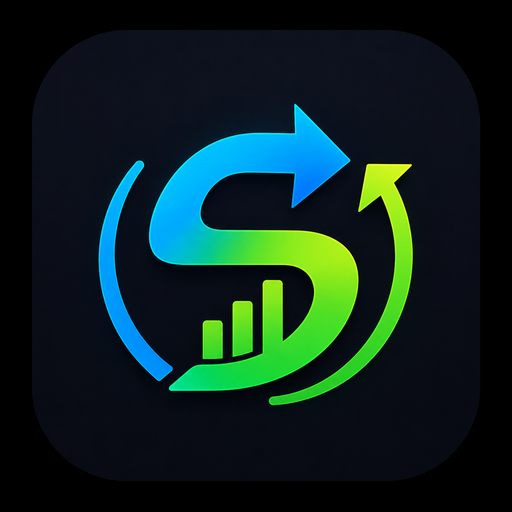
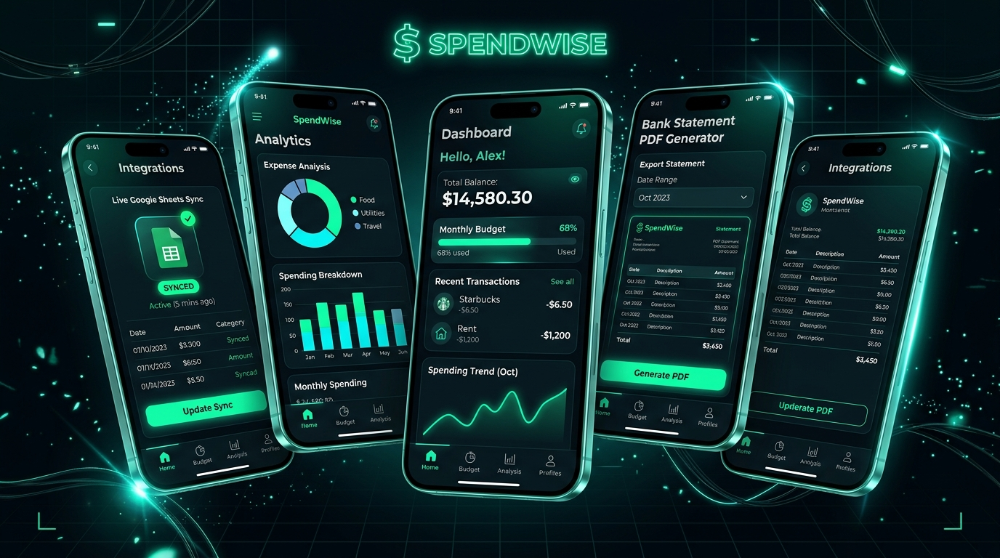

# 🪙 SpendWise — Smart Bank & UPI Expense Tracker

<p align="center">
  
</p>

<h3 align="center">Your Complete Financial Command Center</h3>
<p align="center">
  <b>100% Private • On-Device Sandbox • Automated Multi-User Google Sheets Sync • Official Bank Statement Generator</b>
</p>

<p align="center">
  
  
  
  
  
  
</p>

---

## 🌟 Overview

**SpendWise** is a privacy-first personal finance management system engineered for Android. It operates as a local on-device sandbox that scans incoming bank SMS alerts, calculates real-time running account balances, categorizes expenses, exports password-protected official PDF/Excel statements, and streams transactions live to your personal multi-user Google Spreadsheet.

<p align="center">
  
</p>

---

## ✨ Key Features

### ⚡ 1. 100% Offline Bank SMS Auto-Parsing
* Proprietary on-device regular expression engine that parses debit, credit, UPI merchant IDs, and running account balances locally in **< 5ms**.
* Zero telemetry and zero cloud storage of your SMS content.

### 📱 2. Paytm-Style Executive Interface
* **Top Header**: User avatar with verified shield, real-time **Global Search Bar** (filtering payees, categories, amounts, banks), and direct 24x7 Help & Support shortcut.
* **Quick Service Tiles**: Passbook, Live Sheet Sync, Bank Statements, and SMS Scanner.
* **Hero Balance Card**: Displays real-time bank balance, active bank vector emblem, account number, and monthly savings metrics.

### 🏛️ 3. Authentic Vector Bank Logos (No Emojis)
* Native vector drawables for 25+ major Indian Banks:
  * **Tamilnad Mercantile Bank (TMB)** 🪙
  * **State Bank of India (SBI)** 🏦
  * **HDFC Bank** 🏢
  * **ICICI Bank** 💎
  * **Axis Bank** 🛡️
  * **Kotak Mahindra Bank** ⭐
  * **Bank of Baroda (BOB)** ☀️
  * **Canara Bank** 🔺
  * **Punjab National Bank (PNB)** 🔥
  * **Paytm Payments Bank** 📱

### 📊 4. Multi-User Google Sheets Live Sync Engine
* **Exact Historical Timestamps**: Preserves the original SMS date and time (`yyyy-MM-dd HH:mm:ss`) when syncing transaction history.
* **Dedicated User Tabs**: Each registered account holder automatically gets their own isolated sheet tab (e.g. `Lohith (2741)`).
* **Master User Directory**: The central `_App_Users` ledger registers key identifiers, active timestamps, and sync metrics.
* **Sub-Second Bulk Sync**: Transmits hundreds of historical records in a single payload.

### 🔒 5. Password-Protected Bank Statements (PDF & Excel)
* Authentic bank-grade A4 statements formatted with the official SpendWise brand logo, account summaries, transaction ledgers, opening/closing balance metrics, and date range filters.
* **Deterministic Password Formulas**:
  * `Name + Account (Default)`: First 4 letters of Name + Last 4 digits of Account (e.g., `LOHI5779`, `NAVE4561`).
  * `Name + Mobile`: First 4 letters of Name + Last 4 digits of Mobile (e.g., `LOHI2741`).
  * `Name (End) + Mobile (Start)`: Last 4 letters of Name + First 4 digits of Mobile (e.g., `HITH6379`).
  * `Custom Passcode`: Any user-defined password.

### 🛟 6. 24x7 Help & Support Center
* In-app diagnostic tools:
  * SMS Auto-Read Permission check.
  * Live Google Sheets Webhook Ping test.
  * Interactive troubleshooting FAQs.

### 🌐 7. Google Antigravity-Style Web Download Portal (`web/`)
* Cyber dark-mode web landing page featuring 3D mobile mockup screens, live metadata API (`/api/app-info`), and direct 1-click `/download` streaming `SpendWise.apk`.
* Pre-configured with `render.yaml` for automatic continuous deployment on **Render.com**.

---

## 🏗️ Architecture & Tech Stack

```
SpendWise/
├── app/                              # Native Android Application (Kotlin + Jetpack Compose)
│   ├── src/main/java/.../
│   │   ├── data/
│   │   │   ├── export/               # PDF, Excel, & Google Sheets Sync Managers
│   │   │   ├── local/                # Room Database, DAOs, User Profile Manager
│   │   │   ├── model/                # Bank Directory & Data Models
│   │   │   ├── parser/               # On-Device SMS Inbox Scanner & Regex Engine
│   │   │   └── receiver/             # Broadcast Receiver for SMS OTP Auto-Detection
│   │   ├── ui/
│   │   │   ├── components/           # Bank Logos, Dialogs, Charts, Badges
│   │   │   ├── navigation/           # Compose Navigation Graph
│   │   │   ├── screens/              # Dashboard, Profile, Support, Reports, Settings
│   │   │   └── theme/                # Emerald & Obsidian Dark Mode Design Tokens
│   │   └── res/drawable/             # Official Vector Bank Logos (TMB, SBI, HDFC, etc.)
├── web/                              # Web Portal & APK Distribution Service
│   ├── public/                       # Landing Page, Antigravity Styles, Hero Mockups, APK
│   ├── server.js                     # Native 0-dependency Node.js Distribution Server
│   └── package.json                  # Web Portal Manifest
├── render.yaml                       # 1-Click Render.com Web Service Blueprint
├── SpendWise.apk                     # Pre-Compiled Release APK
└── README.md                         # Project Documentation
```

---

## ⚡ Google Sheets Live Sync Setup

1. Create a new Google Spreadsheet and name it **SpendWise**.
2. Click **Extensions** → **Apps Script**.
3. Replace the editor code with this ultra-fast multi-user script:

```javascript
function doPost(e) {
  var ss = SpreadsheetApp.getActiveSpreadsheet();
  var data = JSON.parse(e.postData.contents);
  var nowStr = Utilities.formatDate(new Date(), Session.getScriptTimeZone() || "GMT+5:30", "yyyy-MM-dd HH:mm:ss");
  
  var userName = (data.user && data.user.name) ? data.user.name : "User";
  var userPhone = (data.user && data.user.phone) ? data.user.phone : "6379982741";
  var userBank = (data.user && data.user.bank) ? data.user.bank : "Primary Bank";
  var userAcc = (data.user && data.user.account) ? data.user.account : "N/A";
  var sheetName = userName + " (" + userPhone.slice(-4) + ")";
  var bankAcc = userBank + " - " + userAcc;
  
  // 1. Get or Create User Dedicated Personal Ledger Tab
  var sheet = ss.getSheetByName(sheetName);
  if (!sheet) {
    sheet = ss.insertSheet(sheetName);
    sheet.appendRow(["ID", "Date & Time", "Type", "Amount (₹)", "Category", "Merchant / Payee", "Bank / Account", "Payment Method", "Note"]);
    sheet.getRange("A1:I1").setBackground("#0F2027").setFontColor("#FFFFFF").setFontWeight("bold");
    sheet.setFrozenRows(1);
  }
  
  // 2. Bulk Batch or Single Transaction Append (Exact Historical Dates)
  if (data.batch && Array.isArray(data.batch) && data.batch.length > 0) {
    var rows = data.batch.map(function(txn) {
      return [
        txn.id || "",
        txn.timestamp || nowStr,
        txn.type || "Expense",
        txn.amount || 0,
        txn.category || "General",
        txn.merchant || "Self",
        bankAcc,
        txn.paymentMethod || "UPI",
        txn.note || ""
      ];
    });
    var startRow = sheet.getLastRow() + 1;
    sheet.getRange(startRow, 1, rows.length, 9).setValues(rows);
  } else {
    var txn = data.transaction || data;
    sheet.appendRow([
      txn.id || "",
      txn.timestamp || nowStr,
      txn.type || "Expense",
      txn.amount || 0,
      txn.category || "General",
      txn.merchant || "Self",
      bankAcc,
      txn.paymentMethod || "UPI",
      txn.note || ""
    ]);
  }
  
  // 3. Master Directory Tab Initializer
  var masterSheet = ss.getSheetByName("_App_Users");
  if (!masterSheet) {
    masterSheet = ss.insertSheet("_App_Users", 0);
    masterSheet.appendRow(["User Mobile (Key)", "User Full Name", "Bank Name", "Primary Account No.", "Dedicated Tab", "Last Active Timestamp"]);
    masterSheet.getRange("A1:F1").setBackground("#1B3B6F").setFontColor("#FFFFFF").setFontWeight("bold");
    masterSheet.setFrozenRows(1);
    masterSheet.appendRow([userPhone, userName, userBank, userAcc, sheetName, nowStr]);
  }
  
  return ContentService.createTextOutput(JSON.stringify({
    status: "success", 
    sheet: sheetName, 
    user: userName
  })).setMimeType(ContentService.MimeType.JSON);
}
```

4. Click **Deploy** → **New Deployment**.
5. Set:
   * **Select type**: `Web app`
   * **Execute as**: `Me`
   * **Who has access**: `Anyone` ⚠️ *(Required so the phone app can sync)*
6. Copy the **Web App URL** and paste it into **SpendWise Settings → Google Sheets Live Sync**.

---

## 🚀 Web Portal Deployment (Render.com)

1. Connect your repository (`Amulpappu/SpendWise`) to [Render.com](https://dashboard.render.com/).
2. Create a new **Web Service** with:
   * **Root Directory**: `web`
   * **Start Command**: `npm start` (or `node server.js`)
   * **Plan**: `Free`
3. Render will deploy the web portal and host the latest `SpendWise.apk` download link!

---

## 🛠️ Building Android App from Source

### Prerequisites
* JDK 17+
* Android Studio Iguana / Ladybug or Android SDK Platform-Tools

### Build & Install:
```bash
# Build Debug APK
./gradlew assembleDebug

# Install to connected device
adb install -r SpendWise.apk
```

---

## 📄 License
Distributed under the MIT License. See `LICENSE` for more information.

---

<p align="center">
  <b>SpendWise</b> — Crafted with Precision for Lohith. 100% Privacy Guaranteed.
</p>
